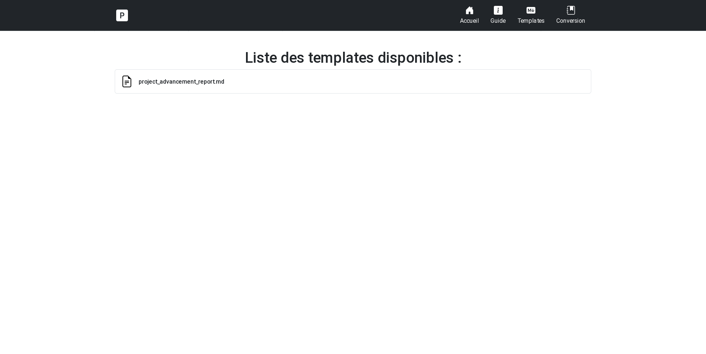

# md2pdf

[](https://choosealicense.com/licenses/mit/)

Un convertisseur de documents Markdown avec IHM intégrée, triviale à déployer, basée sur Pandoc.

## Features

- Elementaire à déployer : uniquement un conteneur Docker
- Une IHM intuitive pour les profils non-techniques

## Preview

<table>
<tr>
    <td>  </td>
    <td>   </td>
</tr>
<tr>
    <td>  </td>
    <td>  </td>
</table>

## Installation

### Docker

Méthode recommandée.
```bash
TODO
```

### En local (pour développement)

1. Instancier un environnement virtual avec `venv` et [`nodeenv`](https://ekalinin.github.io/nodeenv/) :

```bash
$ python3 -m venv .env
$ . env/bin/activate
(env) $ pip install nodeenv
(env) $ npm install
```

2. Lancer l'application :
```bash
(env) $ cd src/app/
(env) $ python3 app.py
```

## License

[MIT](https://choosealicense.com/licenses/mit/)

