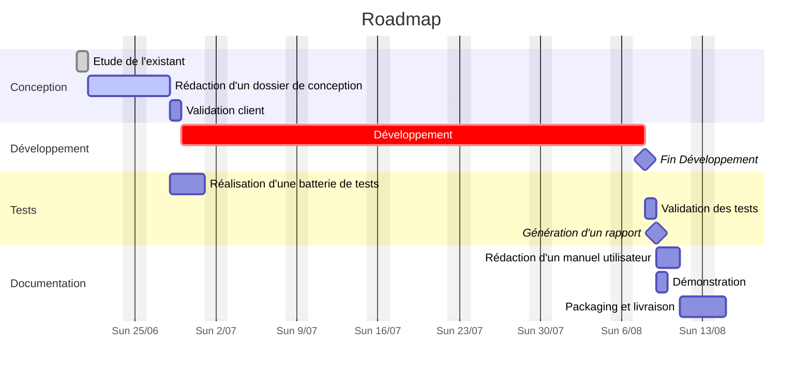
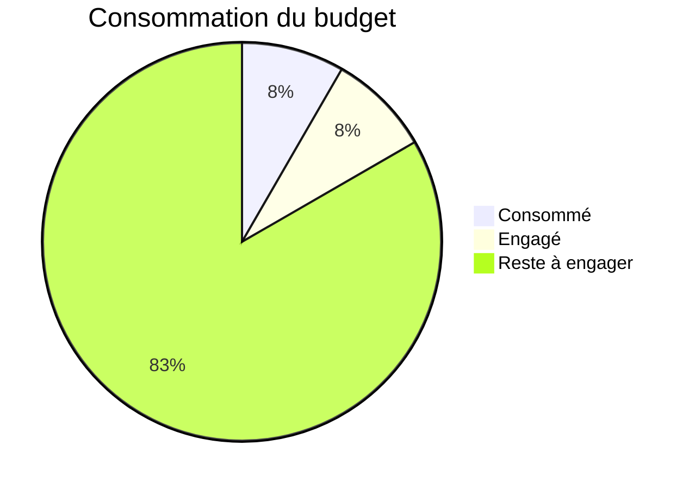

---
title: "Rapport d'avancement"
author:
- Author One
- Author Two
date: "24/06/2023"
project: MyLittleProject
classification : "DR"
...

# Introduction

Ce rapport d'avancement présente une mise à jour détaillée sur l'état actuel du projet en cours. Il fournit une vue d'ensemble des tâches accomplies, des tâches en cours et des tâches à venir. Le rapport est basé sur les informations disponibles jusqu'à la date mentionnée ci-dessus.

# Vue d'ensemble du projet

Le projet en cours, intitulé #project, vise à \[objectif principal du projet\]. Le projet a commencé le \[date de début\] et devrait être terminé le \[date de fin prévue\]. Le budget alloué pour ce projet est de \[montant du budget\].

## Tâches

### Roadmap

### Tâches Accomplies

* \[Nom de la tâche 1\]: Description de la tâche accomplie et résultats obtenus[^1].
* \[Nom de la tâche 2\]: Description de la tâche accomplie et résultats obtenus.
* \[Nom de la tâche 3\]: Description de la tâche accomplie et résultats obtenus.

### Tâches en Cours

* \[Nom de la tâche 4\]: Description de la tâche en cours et état d'avancement.
* \[Nom de la tâche 5\]: Description de la tâche en cours et état d'avancement.
* \[Nom de la tâche 6\]: Description de la tâche en cours et état d'avancement.

### Prochaines Tâches

* \[Nom de la tâche 7\]: Description de la tâche à venir et dates prévues.
* \[Nom de la tâche 8\]: Description de la tâche à venir et dates prévues.
* \[Nom de la tâche 9\]: Description de la tâche à venir et dates prévues.

## Personnel
  
| Personne   | Position        | Commentaire                              |
|:----------:|-----------------|------------------------------------------|
| Alice A.   | Project Manager | Liaison entre équipe technique et client |
| Bob B.     | Architechte     | Référent de conception                   |
| Charlie C. | Developpeur     | Implémentation                           |

## Budget

# Conclusion

Le projet \[Nom du Projet\] progresse conformément à la planification. Les tâches accomplies jusqu'à présent ont atteint les objectifs fixés, et les tâches en cours sont en bonne : . : prochaines étapes du projet sont bien définies, et nous nous engageons à les mener à bien dans les délais impartis. Nous continuerons à surveiller de près l'avancement du projet et à prendre les mesures nécessaires pour garantir sa réussite.

[^1]: Précision en bas de page.
